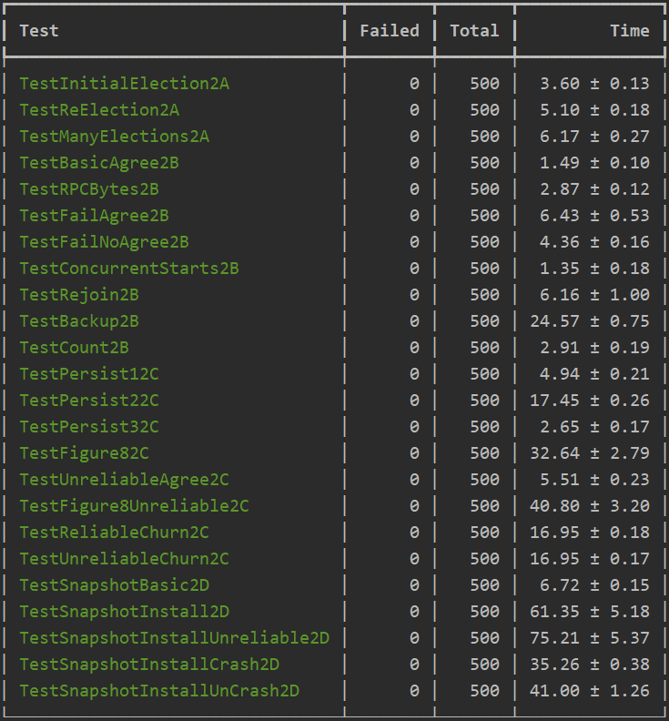
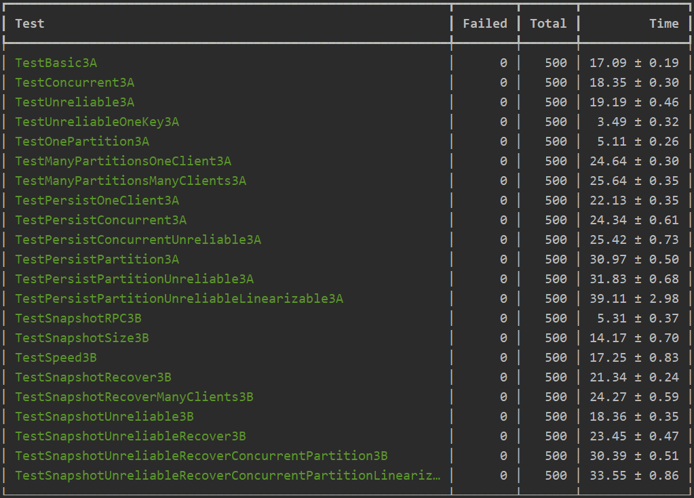
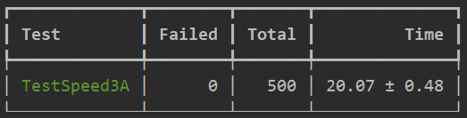
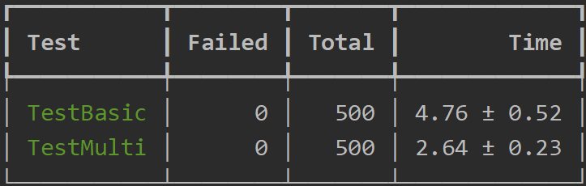
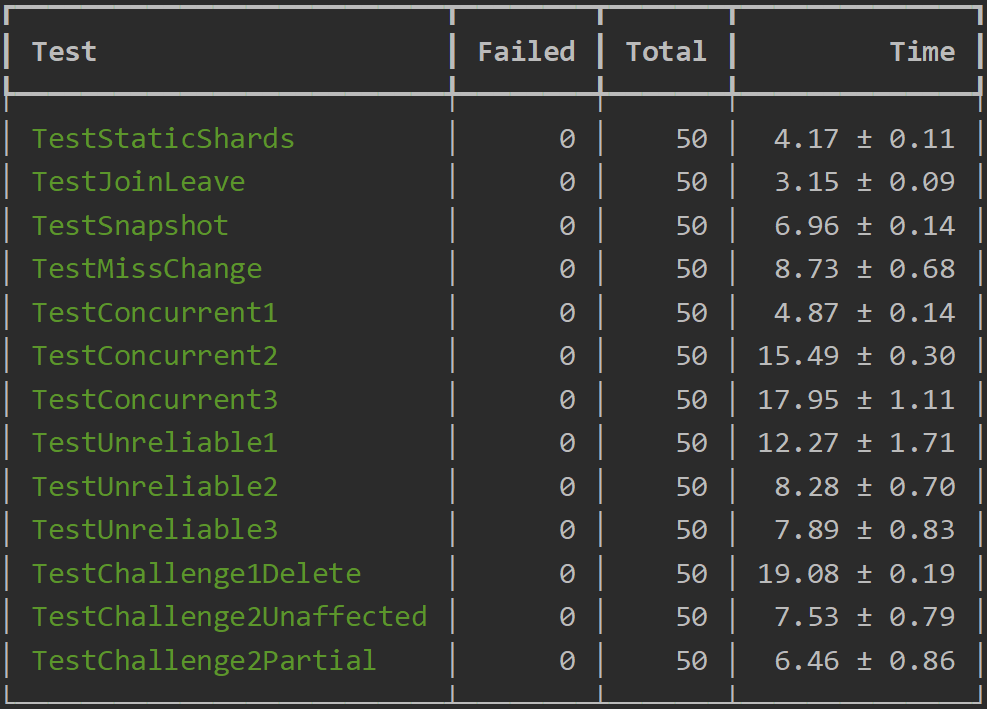

# 6.824: Distributed Systems Labs

> A distributed KV storage system base on Raft.

## Lab 2: Raft Consensus Algorithm

- [x] Part 2A: leader election
- [x] Part 2B: log
- [x] Part 2C: persistence
- [x] Part 2D: log compaction

## Lab 3: Fault-tolerant Key/Value Service

- [x] Part 3A: Key/value service without snapshots
- [x] Part 3B: Key/value service with snapshots

## Lab 4: Sharded Key/Value Service

- [x] Part 4A: The Shard controller
- [x] Part 4B: Sharded Key/Value Serve
  > The test speed is too slow, some hard tests have passed 500 times.

